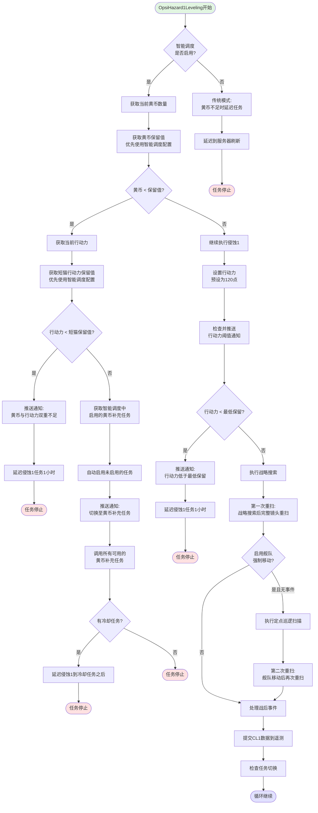
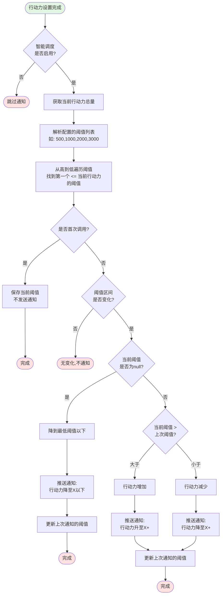

**| [English](README_en.md) | 简体中文 | [日本語](README_jp.md) |**

# AzurLaneAutoScript

我们屁眼通红(Python)真的太有实力了

## 添加了

1. 智能调度
2. 解除大世界限制
3. 如果使用 docker 部署 默认 webui 密码为 123456

## 感谢某不知名 AI IDE 的支持（

请加 QQ 群 1077880342

# 智能调度系统完整逻辑流程图

## 系统概述

智能调度系统(OpsiScheduling)是AzurLaneAutoScript中用于协调大世界任务的核心调度器，负责在侵蚀1练级(OpsiHazard1Leveling)和黄币补充任务(OpsiMeowfficerFarming、OpsiObscure、OpsiAbyssal、OpsiStronghold)之间智能切换。

---

## 核心配置项

### OpsiScheduling 配置

| 配置项                                             | 说明                               | 默认值                  |
| -------------------------------------------------- | ---------------------------------- | ----------------------- |
| `Scheduler.Enable`                                 | 智能调度总开关                     | false                   |
| `OperationCoinsPreserve`                           | 侵蚀1黄币保留值(覆盖原配置)        | 0 (使用原配置)          |
| `ActionPointPreserve`                              | 行动力保留值(覆盖所有任务)         | 0 (使用原配置)          |
| `ActionPointNotifyLevels`                          | 行动力阈值通知列表                 | "500, 1000, 2000, 3000" |
| `OperationCoinsReturnThreshold`                    | 黄币返回阈值                       | null (等于CL1保留值)    |
| `OperationCoinsReturnThresholdApplyToAllCoinTasks` | 黄币阈值是否适用于所有黄币补充任务 | true                    |
| `EnableMeowfficerFarming`                          | 启用短猫相接                       | true                    |
| `EnableObscure`                                    | 启用隐秘海域                       | false                   |
| `EnableAbyssal`                                    | 启用深渊海域                       | false                   |
| `EnableStronghold`                                 | 启用塞壬要塞                       | false                   |

---

## 完整逻辑流程图

---

## 侵蚀1练级任务逻辑

---

## 黄币补充任务逻辑(以短猫相接为例)

---

## 其他黄币补充任务逻辑(隐秘海域/深渊海域)

---

## 行动力阈值通知逻辑

---

## 黄币返回阈值计算逻辑

---

## 任务优先级与执行顺序

### 黄币补充任务固定顺序

当需要尝试其他黄币补充任务时，按以下固定顺序:

1. **OpsiObscure** (隐秘海域)
2. **OpsiAbyssal** (深渊海域)
3. **OpsiStronghold** (塞壬要塞)
4. **OpsiMeowfficerFarming** (短猫相接)

### 任务切换规则

---

## 关键特性说明

### 1. 智能调度启用判定

智能调度功能由 `OpsiScheduling.Scheduler.Enable` 控制，通过 [is_smart_scheduling_enabled(config)](file:///c:/Users/Azur/Desktop/%E9%A1%B9%E7%9B%AE/AzurLaneAutoScript/module/os/tasks/smart_scheduling_utils.py#4-22) 函数统一判断。

### 2. 配置优先级

- **黄币保留值**: 智能调度配置 > CL1原配置
- **行动力保留值**: 智能调度配置 > 各任务原配置

### 3. 推送通知条件

所有推送通知需要同时满足:

1. 智能调度已启用
2. `OpsiGeneral.NotifyOpsiMail` 已启用
3. `Error.OnePushConfig` 已正确配置(provider不为null)

### 4. 任务完成策略

- **智能调度启用**: 禁用任务调度器，由智能调度统一管理
- **智能调度关闭**: 延迟到服务器刷新或指定时间后再运行

### 5. 黄币返回阈值适用范围

通过4个独立开关控制哪些黄币补充任务应用返回阈值:

- `EnableMeowfficerFarming`: 短猫相接(默认启用)
- `EnableObscure`: 隐秘海域(默认关闭)
- `EnableAbyssal`: 深渊海域(默认关闭)
- `EnableStronghold`: 塞壬要塞(默认关闭)

### 6. 行动力阈值通知机制

- 维护上次通知的阈值状态
- 仅在跨越阈值区间时发送通知
- 支持升至/降至两种方向的通知

---

## 核心类与方法

### OpsiScheduling 类

| 方法                                                                                                                                          | 说明                     |
| --------------------------------------------------------------------------------------------------------------------------------------------- | ------------------------ |
| [run_smart_scheduling()](file:///c:/Users/Azur/Desktop/%E9%A1%B9%E7%9B%AE/AzurLaneAutoScript/module/os/tasks/scheduling.py#533-612)           | 智能调度主入口           |
| [\_switch_to_coin_task()](file:///c:/Users/Azur/Desktop/%E9%A1%B9%E7%9B%AE/AzurLaneAutoScript/module/os/tasks/scheduling.py#667-727)          | 切换到黄币补充任务       |
| [\_execute_hazard1_leveling()](file:///c:/Users/Azur/Desktop/%E9%A1%B9%E7%9B%AE/AzurLaneAutoScript/module/os/tasks/scheduling.py#757-772)     | 执行侵蚀1练级            |
| [\_notify_coins_ap_insufficient()](file:///c:/Users/Azur/Desktop/%E9%A1%B9%E7%9B%AE/AzurLaneAutoScript/module/os/tasks/scheduling.py#613-639) | 黄币与行动力双重不足通知 |
| [\_notify_ap_insufficient()](file:///c:/Users/Azur/Desktop/%E9%A1%B9%E7%9B%AE/AzurLaneAutoScript/module/os/tasks/scheduling.py#640-666)       | 行动力不足通知           |
| [\_notify_switch_to_coin_task()](file:///c:/Users/Azur/Desktop/%E9%A1%B9%E7%9B%AE/AzurLaneAutoScript/module/os/tasks/scheduling.py#728-756)   | 切换到黄币补充任务通知   |

### CoinTaskMixin 类

| 方法                                                                                                                                                           | 说明                          |
| -------------------------------------------------------------------------------------------------------------------------------------------------------------- | ----------------------------- |
| [\_get_operation_coins_return_threshold()](file:///c:/Users/Azur/Desktop/%E9%A1%B9%E7%9B%AE/AzurLaneAutoScript/module/os/tasks/scheduling.py#159-211)          | 计算黄币返回阈值              |
| [\_get_smart_scheduling_operation_coins_preserve()](file:///c:/Users/Azur/Desktop/%E9%A1%B9%E7%9B%AE/AzurLaneAutoScript/module/os/tasks/scheduling.py#212-234) | 获取智能调度黄币保留值        |
| [\_get_smart_scheduling_action_point_preserve()](file:///c:/Users/Azur/Desktop/%E9%A1%B9%E7%9B%AE/AzurLaneAutoScript/module/os/tasks/scheduling.py#235-251)    | 获取智能调度行动力保留值      |
| [\_check_yellow_coins_and_return_to_cl1()](file:///c:/Users/Azur/Desktop/%E9%A1%B9%E7%9B%AE/AzurLaneAutoScript/module/os/tasks/scheduling.py#300-348)          | 检查黄币并返回CL1             |
| [\_disable_all_coin_tasks_and_return_to_cl1()](file:///c:/Users/Azur/Desktop/%E9%A1%B9%E7%9B%AE/AzurLaneAutoScript/module/os/tasks/scheduling.py#351-360)      | 禁用所有黄币补充任务并返回CL1 |
| [\_try_other_coin_tasks()](file:///c:/Users/Azur/Desktop/%E9%A1%B9%E7%9B%AE/AzurLaneAutoScript/module/os/tasks/scheduling.py#361-404)                          | 尝试其他黄币补充任务          |
| [\_finish_task_with_smart_scheduling()](file:///c:/Users/Azur/Desktop/%E9%A1%B9%E7%9B%AE/AzurLaneAutoScript/module/os/tasks/scheduling.py#405-446)             | 根据智能调度状态完成任务      |
| [\_handle_no_content_and_try_other_tasks()](file:///c:/Users/Azur/Desktop/%E9%A1%B9%E7%9B%AE/AzurLaneAutoScript/module/os/tasks/scheduling.py#447-518)         | 处理无内容情况并尝试其他任务  |
| [notify_push()](file:///c:/Users/Azur/Desktop/%E9%A1%B9%E7%9B%AE/AzurLaneAutoScript/module/os/tasks/scheduling.py#80-127)                                      | 发送推送通知                  |

### OpsiHazard1Leveling 类

| 方法                                                                                                                                                       | 说明                     |
| ---------------------------------------------------------------------------------------------------------------------------------------------------------- | ------------------------ |
| [os_hazard1_leveling()](file:///c:/Users/Azur/Desktop/%E9%A1%B9%E7%9B%AE/AzurLaneAutoScript/module/os/tasks/hazard_leveling.py#141-423)                    | 侵蚀1练级主循环          |
| [check_and_notify_action_point_threshold()](file:///c:/Users/Azur/Desktop/%E9%A1%B9%E7%9B%AE/AzurLaneAutoScript/module/os/tasks/hazard_leveling.py#69-140) | 检查并推送行动力阈值通知 |
| [notify_push()](file:///c:/Users/Azur/Desktop/%E9%A1%B9%E7%9B%AE/AzurLaneAutoScript/module/os/tasks/scheduling.py#80-127)                                  | 发送推送通知             |

---

## 数据流向

---

## 总结

智能调度系统通过以下机制实现任务的智能协调:

1. **资源监控**: 实时监控黄币和行动力状态
2. **任务切换**: 根据资源状态在CL1和黄币补充任务间切换
3. **优先级管理**: 按固定顺序尝试黄币补充任务
4. **推送通知**: 关键状态变化时及时通知用户
5. **配置覆盖**: 智能调度配置优先于原任务配置
6. **灵活控制**: 支持启用/禁用特定黄币补充任务
